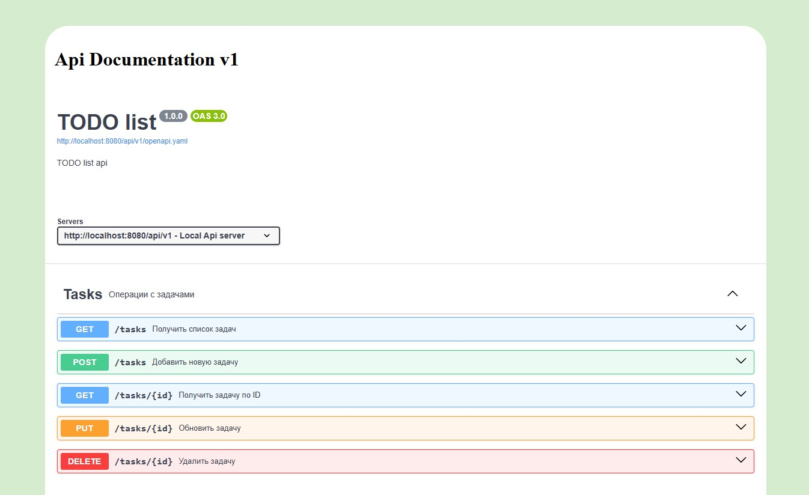

## Тестовое задание. Разработка простого API для управления задачами

### OpenApi и Swagger

В файле роутинга web.php зарегистрированы маршруты для отображения OpenApi спецификации с помощью Swagger.
Сама OpenApi спецификация находится в папке resources/openapi/v1
На главной странице сайта с помощью Swagger можно посмотреть и протестировать все зарегистрированные для api маршруты.

Для вашего удобства задеплоил приложение на хостинг, на поддомен своего сайта.

https://todo.php-developer.pro/

По этой ссылке можно посмотреть документацию и попробовать работу api.

### Реализация Api
- Все маршруты зарегистрированы в файле роутинга api.php.
- За обработку отвечает api resource контроллер TaskController.
- Валидация запросов вынесена в FormRequest.
- Для передачи данных между слоями добавлены DTO классы.
- Логика создания и обработки задач вынесена в отдельные Action классы, которые принимают DTO.
- Для обработки исключений создал отдельные классы исключений для api
- Ответы реализованы с помощью JsonResource и коллекций
- Для работы со статусом добавлен EnumStatus

### Тестирование
В PhpUnit Добавлены несколько базовых feature тестов для Controller, Action и DTO

Для тестирования и визуализации данных добавлены Фабрики и Сиды для загрузки первоначальными данными
